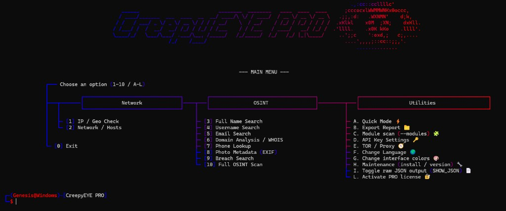
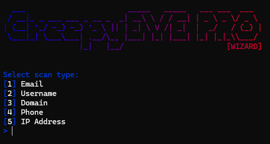
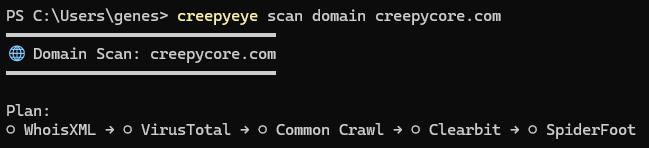
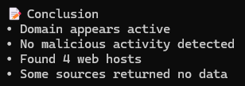
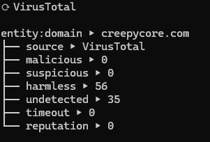
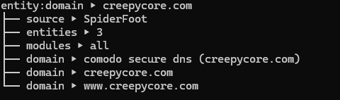
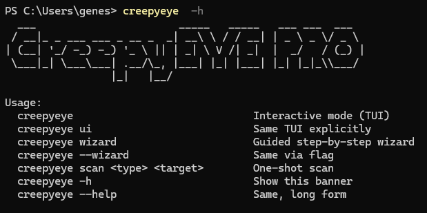

# CreepyEYE PRO


-purple)
-blue)


**CreepyEYE PRO** is a desktop OSINT application for Windows and Linux with a **lifetime licence**
(one purchase, no subscription). You buy it in **CreepyCORE**, download a signed installer from your
**License** page, enter the key once per device — and work. Scans run **locally on your machine**.

> ⚠️ **Ethical OSINT only.** CreepyEYE PRO is for lawful open-source intelligence. You are responsible
> for your targets and for having a lawful basis to process personal data. See [Legal & EULA](#legal--eula).

> 📖 **This repository is documentation only.** CreepyEYE PRO is closed-source and commercial —
> the engine is not published here. The free and open edition is
> **[CreepyEYE Genesis](https://github.com/CreepyHunterX/CreepyEYE-Genesis)**.

**[⬇️ Get CreepyEYE PRO → creepycore.com](https://creepycore.com/store)** ·
[Full user guide](https://creepycore.com/creepyeye-pro) ·
[FAQ](https://creepycore.com/faq) ·
[Support](mailto:support@creepycore.com)

---

## Contents

1. [What you get](#what-you-get)
2. [Genesis, PRO or the cloud](#genesis-pro-or-the-cloud)
3. [Install](#install)
4. [Activate your licence](#activate-your-licence)
5. [Your first scan](#your-first-scan)
6. [Integrations (37)](#integrations-37)
7. [Bring Your Own Key (BYOK)](#bring-your-own-key-byok)
8. [Your devices](#your-devices)
9. [Reports](#reports)
10. [CLI reference](#cli-reference)
11. [Security & privacy](#security--privacy)
12. [Troubleshooting](#troubleshooting)
13. [Legal & EULA](#legal--eula)
14. [Support](#support)

---

## What you get

- **Desktop OSINT app** for Windows and Linux (macOS is not available yet).
- **Lifetime licence** — one purchase, no monthly fee.
- **37 provider integrations** plus CreepyEYE's own multi-site username prober. Some work out of the
  box; the rest switch on when you add your own provider key (**[BYOK](#bring-your-own-key-byok)**).
- **Up to 3 devices** per licence, managed in the web **Device Hub**.
- **Two ways to work** — a full-screen menu (TUI) or a step-by-step wizard; results render as a tree
  with a plain-language **Conclusion** at the end.
- **EXIF / image metadata** analysis, proxy and CAPTCHA handling, optional Tor.
- **Report export** (human-readable or JSON).

Payment, your licence and your devices live in the **CreepyCORE** cloud. **Scans run locally** —
your provider keys never leave your computer.

| Main menu | Scan wizard |
|---|---|
|  |  |

| Domain scan | Conclusion |
|---|---|
|  |  |

---

## Genesis, PRO or the cloud

|                | **Genesis** | **CreepyEYE PRO** | **CreepyCORE (cloud)** |
|----------------|-------------|-------------------|------------------------|
| What it is     | Free, local, open source | Lifetime desktop app | Observer / Hunter subscription |
| Price          | Free | One-time purchase | Monthly |
| Integrations   | Limited set | **37 modules (BYOK)** | Cloud scans + Platform API (**sold separately**) |
| Devices        | 1 | **Up to 3** | Web sessions + PRO activations in the Hub |
| Account needed | No | Optional (for Device Hub) | Yes |

> ℹ️ **CreepyEYE PRO ≠ CreepyCORE Platform API.** Buying PRO does **not** give you cloud API keys
> (`ck_live_*`) — that is a separate product (Hunter plan). See the
> [Platform API guide](https://creepycore.com/guide).

> **Status:** **Genesis**, **CreepyEYE PRO** and the **Observer** / **Hunter** cloud plans are
> released. **Titan**, **Seeker** and **Spectre** are still in development and are not on sale.

---

## Install

CreepyEYE PRO ships as a **ready-made signed installer** — nothing to build by hand.

1. **Buy it** in CreepyCORE → **[Store](https://creepycore.com/store)**.
2. **Accept the EULA.** Open **License** in your dashboard — the agreement is shown above the
   download button (up to 3 devices per key, lawful use only, and so on). Downloading means you
   accept it.
3. **Download the build for your OS:**
   - **Windows:** `CreepyEYE-PRO-Setup.exe` (signed)
   - **Linux:** `CreepyEYE-PRO-…-linux-x86_64.tar.gz`
4. **(Recommended) verify the checksum** against the `SHA256SUMS.txt` published next to the download:

   ```powershell
   # Windows (PowerShell)
   Get-FileHash .\CreepyEYE-PRO-Setup.exe -Algorithm SHA256
   ```

   ```bash
   # Linux
   sha256sum CreepyEYE-PRO-*.tar.gz
   ```

   The value must match the matching line in `SHA256SUMS.txt`. If it does not — do not run the file,
   re-download it, and tell us at **security@creepycore.com**.
5. **Install and run** — on Windows run the `.exe` and follow the wizard; on Linux unpack the archive
   and start the app from inside it.

**System requirements**

| | |
|---|---|
| OS | Windows 10/11, or a current Linux distribution (x86-64) |
| Network | Internet access for activation and licence refresh |
| Terminal | The in-app menu needs a **wide window** — roughly **120×35** characters or larger. On a narrow terminal use the [wizard](#your-first-scan). |
| Optional | Node.js 20+ only if you use the TypeScript CLI; Python 3.10+ only if you run from source |

---

## Activate your licence

After buying, CreepyCORE gives you a key that looks like this:

```text
CEYE-PRO-XXXX-XXXX-XXXX-XXXX
```

1. Open CreepyEYE PRO on your computer.
2. Enter the key in the activation field (**License / Activate** in the app), or from a shell:

   ```bash
   creepyeye activate CEYE-PRO-XXXX-XXXX-XXXX-XXXX
   ```

3. That's it — the key is entered **once per device**; afterwards the app refreshes access by itself.

You do **not** need to type a server address: the official installer already points at CreepyCORE.

**Re-activation** is only needed if you install PRO on a **new computer** while all 3 slots are taken
(free one up in the [Device Hub](#your-devices)), or if this device was revoked.

**Linking to your account (optional, but handy).** If you are signed in to CreepyCORE while
activating, the licence shows up under your email in the web **License** and **Device Hub**
sections — which makes managing devices much easier.

| Where in CreepyCORE (web) | What for |
|---|---|
| **Store** | Buy CreepyEYE PRO |
| **License** | Download the app, see your key, link it to your account |
| **Device Hub** | List your activated devices, free up a slot |

---

## Your first scan

1. **Start the app.** You get the **main menu** (Network / OSINT / Utilities categories) — or run
   `creepyeye wizard` for the step-by-step wizard if your window is narrow.
2. **Pick a target type** — email, username, domain, phone, IP, name, network or a photo file.
3. **Enter the target.** The app runs the available modules one by one and shows results as a tree.
4. **Read the Conclusion.** The summary block at the end says the important things in plain words:
   whether the domain is live, whether threats were found, how many hosts turned up, and so on.

> A module with no provider key, or with no data for this target, is simply **skipped** — that is
> normal, not an error. See [BYOK](#bring-your-own-key-byok).

Example modules mid-scan:

| VirusTotal | SpiderFoot |
|---|---|
|  |  |

---

## Integrations (37)

CreepyEYE PRO ships **38 scan modules**: 37 third-party providers plus CreepyEYE's own multi-site
username prober. Most of them need **your own provider key** — see
[BYOK](#bring-your-own-key-byok).

| Category | Modules | Providers |
|---|---|---|
| **Network / infrastructure** | 14 | Shodan, Censys, SecurityTrails, WhoisXML, AbuseIPDB, GreyNoise, IPinfo, IPStack, IP-API, IPQualityScore, GeoIP API, GeoNames, NumVerify, PhoneInfoAPI |
| **People** | 9 | Hunter.io, EmailRep.io, Clearbit (email + domain), FullContact, People Data Labs, Pipl, Whitepages Pro, Telegram (Telethon MTProto) |
| **Breaches & leaks** | 6 | Have I Been Pwned, DeHashed, Snusbase, Intelligence X, DarkOwl Vision, Pastebin |
| **Intelligence** | 4 | VirusTotal, AlienVault OTX, BuiltWith, Common Crawl |
| **Integrations** | 3 | SpiderFoot, Recon-ng, ExifTool |
| **Username** | 2 | Sherlock, CreepyEYE multi-site HTTP probes |

**Supported target types:** `email` · `username` · `domain` · `phone` · `ip` · `name` · `network` ·
`photo` (EXIF).

📄 **[Full service reference → docs/services/](docs/services/README.md)** — one page per module with
the provider's full capability, the endpoints CreepyEYE actually calls, the fields shown in the UI,
and the API-key variable name.

> ❌ **Not included:** deep scan (`dark_scan`) is **CreepyEYE Titan** only (still in development),
> and the cloud **Platform API** (`ck_live_*`) is the **Hunter** plan — neither comes with PRO.

---

## Bring Your Own Key (BYOK)

Many modules talk to external services (Shodan, VirusTotal, Have I Been Pwned…). CreepyEYE PRO
**does not bundle paid keys** — you add your **own**:

1. Get a free or paid key from the provider.
2. Add it in the app's key settings, or from a shell:

   ```bash
   creepyeye config set SHODAN_API_KEY <your-key>
   creepyeye config set shodan_key <your-key>     # short alias, same thing
   creepyeye config list                          # what is set (values masked)
   ```

3. The module now returns data. Without a key it is skipped.

Common variables: `SHODAN_API_KEY`, `VIRUSTOTAL_API_KEY`, `HAVEIBEENPWNED_API_KEY`,
`HUNTERIO_API_KEY`, `CENSYS_API_KEY`, `ABUSEIPDB_API_KEY`, `IPINFO_API_KEY`, `DEHASHED_API_KEY`,
`INTELLIGENCEX_API_KEY` and more — the exact name for each module is on its
[service page](docs/services/README.md). Handy aliases: `shodan_key`, `vt_key`, `hibp_key`,
`intelx_key`.

> 🔒 Your keys are stored **locally** (`settings/api/api_keys.env`) and are **never sent to
> CreepyCORE**. Do not share or commit that file. If it ever leaks, **rotate every key immediately**.

---

## Your devices

- One PRO licence runs on **3 devices at once** (Titan is planned to allow up to 10).
- Activating a 4th shows **`DEVICE_LIMIT`** and asks you to free a slot.

**Manage them on the web:**

1. Sign in to CreepyCORE.
2. Open **Device Hub** (Dashboard → Devices), or **License → Open Device Hub**.
3. You see your **real activations** — actual machines, not browser sessions.
4. Press **Revoke** on a device you no longer use → the slot is free for a new one.

> A revoke takes effect on that machine at its next access refresh.

---

## Reports

- Export the last scan from the **Report** menu item, or `creepyeye report`.
- `creepyeye history` lists past scans by their `SCN-ID`, so you can export an older one.
- `--json` / `--output json` gives machine-readable output for your own pipelines.
- Reports are written to the app's reports folder on your computer.

---

## CLI reference

> This section is for technical users. The in-app menu covers everything most people need.

```bash
creepyeye                       # interactive menu (TUI) — the default
creepyeye ui                    # the same menu, explicitly
creepyeye wizard                # step-by-step wizard (good for narrow terminals)
creepyeye --help                # full usage banner
```

**Scanning**

```bash
creepyeye scan email    user@example.com
creepyeye scan username someuser
creepyeye scan domain   example.com
creepyeye scan phone    +15551234567
creepyeye scan ip       8.8.8.8
creepyeye scan name     "John Smith"
creepyeye scan network  example.com
creepyeye scan photo    ./photo.jpg        # EXIF / metadata
```

**Commands**

| Command | What it does |
|---|---|
| `creepyeye report` | Export a report (last scan, or a given `SCN-ID`) |
| `creepyeye history` | List past scans by `SCN-ID` |
| `creepyeye doctor` | Diagnose licence, keys and environment |
| `creepyeye update` | Check for updates |
| `creepyeye version` | Show the installed version |
| `creepyeye setup` | Install Python dependencies (source runs only) |

**Licence**

| Command | What it does |
|---|---|
| `creepyeye activate <key>` | Activate the PRO licence on this device |
| `creepyeye deactivate` | Deactivate PRO on this device |

**Configuration & output**

| Command | What it does |
|---|---|
| `creepyeye config list / get <key> / set <key> <value>` | Manage BYOK keys (values are masked on read) |
| `creepyeye pii [safe / balanced / raw]` | How much personal data is unmasked in output |
| `creepyeye language [list / <code>]` | UI language (English, Ukrainian, Russian…) |
| `creepyeye view [list / stream / intel]` | Scan layout — live stream (default) or intel report |
| `creepyeye scan-theme [list / dracula / semantic / white]` | Scan colour theme |
| `creepyeye --symbols ascii` | `[OK] [WARN] [INFO]` tags instead of `✔ ⚠ ❌` glyphs |

**Common flags:** `--json`, `--output human|json`, `--timeout SEC`, `--proxy URL`, `--verbose`.



**Environment variables**

| Variable | Description |
|---|---|
| `CREEPYEYE_CONFIG_DIR` | Use a different config directory instead of `~/.creepyeye_pro` |
| `CREEPYEYE_WEB_API_TOKEN` | Bearer token for the local Web API (bound to `127.0.0.1`) |
| `CREEPYEYE_PRODUCTION=1` | Production hardening mode (already on in packaged builds) |

> CreepyCORE is a hosted service, not a self-hosted package. The official installer is already
> pointed at it — you do not need to (and cannot) run your own server.

---

## Security & privacy

- **Your keys stay yours.** Provider keys and the activation token live on your machine only.
  CreepyCORE never receives them. Cache files under `~/.creepyeye_pro/` are restricted to your user
  account (`0600` on Unix, `icacls` on Windows).
- **Server-verified licensing.** Access is confirmed by the server with an Ed25519 signature; the
  local activation file is a **cache**, not a way around the check.
- **Limited offline use.** After a successful check the app keeps working without internet for a
  grace period. That is a convenience, not a replacement for a licence.
- **Integrity protection.** The app watches the integrity of its own environment. On serious
  tampering it blocks scans and network access until it recovers — that is deliberate, not a crash.
- **Never share `activation.json`.** It holds a live activation token. If it was ever shared or
  committed somewhere: **revoke that device** in CreepyCORE → Devices, delete the local file, and
  re-activate.
- **SpiderFoot** runs locally on `127.0.0.1`. Do not expose its port (`5001`) beyond your host,
  especially on a shared machine.

Found a vulnerability? Email **security@creepycore.com** — please do not exploit it.
See [SECURITY.md](SECURITY.md) for the full responsible-use and hardening policy.

---

## Troubleshooting

| Symptom | What to do |
|---|---|
| Menu looks broken, frames overlap | Your window is too small — enlarge the terminal (≈120×35+) or use `creepyeye wizard`. This is not a licence problem. |
| `NOT_ACTIVATED` | Activate the key again (License in the app, or `creepyeye activate <key>`). |
| `DEVICE_LIMIT` | Free a slot in the [Device Hub](#your-devices) — revoke an old device. |
| Activation error (401 / 403) | Check your internet connection and try activating again. |
| "Feature check failed" | Check internet **and your system clock**; the device may have been revoked. |
| A module returns nothing | No provider key for that module — add one ([BYOK](#bring-your-own-key-byok)). |
| "Where is my `ck_live_` API key?" | Different product — that is the cloud **Platform API** (Hunter plan), not PRO. |

The app also has built-in diagnostics: **`creepyeye doctor`** checks licence, keys and environment.


---

## Legal & EULA

CreepyEYE PRO is an **open-source-intelligence (OSINT)** tool.

**Allowed:** lawful security research and OSINT in your jurisdiction; auditing **your own** accounts
and systems, or systems you are authorised to test; learning and professional work done ethically
and legally.

**Prohibited:** unauthorised access, phishing, stalking, unlawful surveillance, circumventing
licensing or protection mechanisms, and breaking third-party API terms.

- You are responsible for your targets and for having a **lawful basis** to process personal data
  (GDPR and equivalents).
- **Up to 3 devices** per key. Reverse engineering the binaries is prohibited (EULA §2), except where
  the law expressly allows it.
- Third-party components (SpiderFoot, Sherlock, ExifTool and others) carry **their own licences**
  (EULA §8).
- The tool is provided **as-is**; we do not guarantee the completeness of third-party data and are
  not responsible for unlawful use.

The full EULA is shown in the **License** section, above the download button.

---

## Support

| Resource | Where |
|---|---|
| **Buy** | [creepycore.com/store](https://creepycore.com/store) |
| **User guide (full)** | [creepycore.com/creepyeye-pro](https://creepycore.com/creepyeye-pro) |
| **Key / download** | Dashboard → **License** |
| **Devices** | Dashboard → **Device Hub** |
| **FAQ** | [creepycore.com/faq](https://creepycore.com/faq) |
| **Help centre** | [creepycore.com/guide](https://creepycore.com/guide) |
| **Support** | [support@creepycore.com](mailto:support@creepycore.com) |
| **Security reports** | [security@creepycore.com](mailto:security@creepycore.com) |
| **Free edition** | [CreepyEYE Genesis on GitHub](https://github.com/CreepyHunterX/CreepyEYE-Genesis) |

Licence, activation or device questions → **support@creepycore.com**.

---

*CreepyEYE PRO is a product of CreepyCORE. Documentation last updated: September 2026.*
